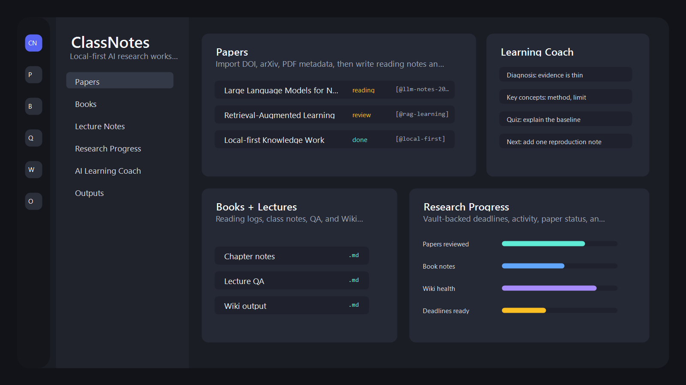

# ClassNotes

> Local-first AI research workspace for researchers and graduate students.

[]()
[]()
[]()
[](LICENSE)

ClassNotes is a desktop app for building an Obsidian-compatible research vault.
It brings papers, books, lecture notes, reading notes, citations, research
progress, and optional GPT / Gemini / Claude learning agents into one local workspace.

The first public target is **researchers and graduate students** who want a
plain Markdown knowledge base without locking their notes into a hosted service.

## Why ClassNotes

| Need | ClassNotes approach |
|---|---|
| Keep ownership of notes | Stores Markdown, JSON, BibTeX, and outputs inside your local Vault |
| Work across papers, books, and classes | Dedicated Papers, Books, QA, Wiki, Progress, and Outputs views |
| Use AI without forcing AI | GPT, Gemini, Claude, and disabled modes are supported globally |
| Stay Obsidian-compatible | Wikilinks, frontmatter, Markdown notes, attachments, and generated outputs remain file-based |
| Move from reading to writing | Citation picker, BibTeX export, LaTeX export, and research dashboard are built in |

ClassNotes is not trying to replace Obsidian or Zotero. It is a companion layer
for research workflows where local notes, literature metadata, and AI-assisted
understanding need to meet in the same place.

## Preview



## Current Status

ClassNotes is pre-1.0 software. Windows packaging is the first-class target
today. macOS and Linux build support exists in the project configuration, but
Windows is the only release path considered ready for early public users.

Recent verification:

- `npm run lint`
- `npm test -- --run`
- `npm run test:coverage` — baseline coverage gate enabled
- `npm run build`
- `npm run dist`
- `npm run test:release-smoke`
- `npm run hash:release`
- `npm run test:release-artifacts`
- `npm run security:evidence`
- `npm audit` — vulnerabilities: 0
- `npm audit --omit=dev` — production vulnerabilities: 0
- `npm run license:check`

Bundle snapshot:

- `app.asar`: about 31.9 MB
- Portable EXE: about 71.1 MB
- Initial renderer JS chunk: about 242 KB

## Install

Download the latest Windows build from the repository's GitHub Releases page:

- `ClassNotes-<version>-Setup.exe` for a normal installer
- `ClassNotes-<version>-Portable.exe` for a portable build

Until the SignPath Foundation code-signing certificate is active, Windows
builds may show a SmartScreen warning. See **Code Signing** below for the
current status and how to verify what you downloaded.

Release assets include `SHA256SUMS.txt` when hashes are generated. To verify a
downloaded EXE on Windows:

```powershell
Get-FileHash .\ClassNotes-<version>-Portable.exe -Algorithm SHA256
Get-Content .\SHA256SUMS.txt
```

The hash printed by `Get-FileHash` should match the line for that EXE.

## Code Signing

ClassNotes is applying to the [SignPath Foundation](https://signpath.org)
Open Source code-signing program. Once the application is approved and
the certificate is provisioned, Windows release builds will be signed by
**SignPath Foundation**, the SmartScreen warning will gradually disappear,
and `electron-updater`'s auto-update channel will activate.

The full project policy — team roles, signing scope, release flow, and
reporting channels — lives in
[docs/code-signing-policy.md](docs/code-signing-policy.md). End-user
verification steps (Digital Signatures dialog, `signtool verify`, SHA-256
cross-check) live in [SECURITY.md](SECURITY.md#verifying-a-release).

> Free code signing will be provided by [SignPath.io](https://signpath.io),
> certificate by [SignPath Foundation](https://signpath.org).

## First Run

1. Choose or create a Vault folder.
2. Optionally install the sample Vault.
3. Choose a global AI provider from the top-left rail selector:
   - GPT (OpenAI API key or Codex CLI login)
   - Gemini (Gemini API key, Gemini CLI login, or Google ADC fallback)
   - Claude (Anthropic API key or Claude Code CLI login)
   - Off
4. Start with Papers, Books, lecture notes, or the research progress dashboard.

The left icon rail starts in **Simple** mode. Press `+` to add only the views or
commands you use, or switch to **Full** when you want every major feature shown.

AI is optional. Without AI configuration, the app still works as a local
Markdown research workspace.

## Core Workflows

- **Papers**: import DOI/arXiv/PDF metadata or Zotero / Better BibTeX `.bib`
  files, keep reading notes, insert
  `[@bibkey]` citations, export `refs.bib`, and generate LaTeX outputs.
- **Books**: track reading status, ratings, page progress, and timestamped
  reading notes.
- **Lectures**: keep subject notes, ask course-specific QA, and save useful
  answers into Wiki pages.
- **AI Learning Agents**: run source-specific help for books, papers, and
  lectures. Outputs are saved back as Markdown blocks.
- **Research Progress**: track deadlines, recent activity, paper/book status,
  and basic Wiki health from Vault files.
- **Plugins**: load early-stage Vault plugins from
  `.classnotes/plugins/*/plugin.json`. Plugin views run in sandboxed iframes
  without Node/Electron access.

## Privacy

ClassNotes is local-first.

- Notes are stored in the Vault folder you choose.
- AI requests are sent only when you use an AI feature.
- API keys are stored with Electron `safeStorage`.
- Crash reporting and telemetry are opt-in.

Read [docs/privacy.md](docs/privacy.md) for details.

## Development

Requirements:

- Node.js 20
- npm 10
- Windows 11 for the supported packaging path

```bash
git clone https://github.com/kodakku22/class-note.git
cd class-note
npm ci
npm run dev
```

Useful commands:

```bash
npm run lint
npm test -- --run
npm run build
npm run dist
npm run test:coverage
npm run test:release-smoke
npm run hash:release
npm run test:release-artifacts
npm run security:evidence
npm run license:check
npm run measure:bundle
npm run perf:vault
```

Key project documents:

- [Architecture](docs/architecture.md)
- [Threat model](docs/threat-model.md)
- [Security evidence](docs/security-evidence.md)
- [External audit readiness](docs/external-audit-readiness.md)
- [Operations guide](docs/operations.md)
- [Performance](docs/performance.md)
- [Research workflows](docs/research-workflows.md)
- [Privacy](docs/privacy.md)
- [Distribution](docs/distribution.md)
- [Code signing policy](docs/code-signing-policy.md)
- [Roadmap](ROADMAP.md)
- [Governance](GOVERNANCE.md)
- [Contributing](CONTRIBUTING.md)
- [Security policy](SECURITY.md)

## Contributing

Issues and pull requests are welcome. Good starting labels:

- `good first issue`
- `help wanted`
- `research-workflow`
- `ai-agent`
- `packaging`

Please read [CONTRIBUTING.md](CONTRIBUTING.md), [SECURITY.md](SECURITY.md), and
[CODE_OF_CONDUCT.md](CODE_OF_CONDUCT.md) before opening a large change.

## Roadmap

Public roadmap focus:

- Research workflow stabilization
- AI agent quality and source-specific prompts
- Bundle and startup lightweighting
- Windows code signing and auto-update polish
- macOS/Linux release validation

See [ROADMAP.md](ROADMAP.md) for milestone gates and non-goals.

## Citation

Academic citation metadata is provided in [CITATION.cff](CITATION.cff).

## License

Apache License 2.0. See [LICENSE](LICENSE).
