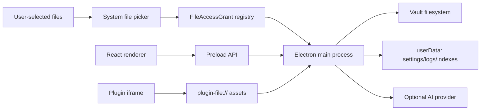

# Threat Model

This document describes the security boundaries ClassNotes depends on. It is a
living design note for maintainers and reviewers, not a guarantee that every
possible attack is eliminated.

## Scope

In scope:

- Local Vault files selected by the user.
- Electron main process IPC handlers.
- Renderer code and the preload bridge.
- External file import through system pickers.
- AI provider calls through OpenAI / Gemini / Anthropic API, or official local login paths (Codex CLI, Gemini CLI / Google ADC, Claude Code CLI).
- Local logs, diagnostics, Sentry, telemetry, and updater behavior.
- Plugin iframes and plugin asset serving.
- Release artifacts and dependency supply chain.

Out of scope:

- A compromised operating system account.
- Malicious modified builds not produced by the release pipeline.
- Physical access to an unlocked machine.
- Security of third-party services after a user explicitly sends data to them.

## Assets

| Asset | Why it matters | Protection target |
|---|---|---|
| Vault contents | Research notes may contain private or unpublished work | No access outside user-selected Vault without explicit import |
| API keys | Can spend money or access user accounts | Never expose decrypted keys to renderer or logs |
| Diagnostics/logs | Support data can accidentally reveal private paths or notes | Redact secrets, paths, and note bodies |
| External files | Picker paths can point anywhere on disk | Short-lived capability token before import |
| Release artifacts | Users install trusted binaries | Build, smoke test, hash, and sign when possible |
| Plugin assets | Plugins run user-controlled HTML/JS | Sandboxed iframe and scoped asset protocol |

## Trust Boundaries

The renderer is not trusted with ambient filesystem authority. It receives a
limited preload API and asks the main process to perform privileged operations.

## Main Attack Paths

### 1. Renderer tries to read arbitrary files

Risk:

- A malicious note, dependency, or plugin script attempts to pass a system path
  to an IPC handler.

Mitigations:

- Filesystem IPC validates paths against the active Vault.
- `app-file://` rejects paths outside the active Vault.
- `plugin-file://` only serves registered plugin asset paths.
- External file imports use short-lived, one-use `FileAccessGrant` tokens.

Reviewer checklist:

- New IPC handlers must call `validateVaultPath` or use a capability token.
- Never accept raw external paths from renderer drag/drop without a grant.

### 2. Picker token reuse or confusion

Risk:

- A PDF picker token is reused for BibTeX import, replayed after one import, or
  used by a different renderer sender.

Mitigations:

- Grants are purpose-specific.
- Grants expire quickly.
- Grants are one-use.
- Grants are bound to the sender that created them.

Reviewer checklist:

- Every new external-file import purpose must add tests for missing token,
  expired token, wrong purpose, wrong sender, and replay.

### 3. API key exposure

Risk:

- The renderer, logs, diagnostics, Sentry, or telemetry leak API keys.

Mitigations:

- API keys are stored with Electron `safeStorage`.
- Renderer can set, clear, and query presence; it cannot read the key.
- Logs and diagnostics pass through `redactSecrets`.
- Telemetry and Sentry are opt-in and configured as no-ops without endpoints.

Reviewer checklist:

- Do not add API keys to renderer-visible settings.
- Do not log request headers or provider env vars.

### 4. Note body leakage through diagnostics

Risk:

- A support bundle contains private research text.

Mitigations:

- Diagnostics include safe settings summary, index status, recent redacted log
  lines, and error counts only.
- Diagnostics do not include note bodies, file names, API keys, or absolute
  Vault paths.

Reviewer checklist:

- Any new diagnostics field must be justified as support-critical and covered by
  redaction tests.

### 5. Supply-chain compromise

Risk:

- A dependency update introduces vulnerable code or release artifacts are
  tampered with.

Mitigations:

- CI runs full `npm audit` and production `npm audit --omit=dev`.
- License checks run before release.
- Release artifacts are smoke-tested and hashed.
- Dependabot tracks npm and GitHub Actions updates.

Reviewer checklist:

- Dependency updates must explain why the package is needed.
- Release assets must be distributed with `SHA256SUMS.txt`.

## Security Invariants

- Decrypted API keys never cross into the renderer.
- External file import requires a purpose-specific grant token.
- Vault path validation happens in main, not in renderer.
- Diagnostics are local files and contain no note bodies.
- Telemetry/Sentry remain opt-in.
- Plugin iframes have no Node/Electron access.
- Release artifacts are built from CI quality gates.
- SBOM and IPC surface manifests can be regenerated with
  `npm run security:evidence`.

## Known Residual Risks

- Pre-1.0 releases are Windows-first; macOS and Linux security behavior still
  needs release validation.
- Code signing is planned but not yet guaranteed for all public builds.
- Single-maintainer operational risk remains until more reviewers are active.
- A malicious local user with OS account access can read the Vault directly.

## Audit Evidence

Repeatable evidence for external reviewers is documented in
[security-evidence.md](security-evidence.md). It includes the dependency SBOM,
IPC channel manifest, and reviewer checklist for security-sensitive changes.
